# Лабораторная работа №2: HTTP-методы: обработка GET, POST,
PUT, DELETE

**Студент:** Калмазова Серафима Владимировна  
**Группа:** ПИЖ-б-о-25-1  
**Вариант:** 14 (Рестораны, продвинутый уровень)  
**Технология:** Node.js + Express

---

## Содержание
1. [Цель работы](#цель-работы)
2. [Теоретическое обоснование](#теоретическое-обоснование)
3. [Выполнение практического примера](#выполнение-практического-примера)
4. [Выполнение индивидуального задания](#выполнение-индивидуального-задания)
5. [Контрольные вопросы](#контрольные-вопросы)
6. [Вывод](#вывод)
7. [Список использованных источников](#список-использованных-источников)


## Цель работы
Освоить обработку различных HTTP-методов (GET,
POST, PUT, DELETE) в Express/Flask. Научиться реализовывать CRUDоперации над коллекцией объектов, хранящейся в памяти сервера, а также возвращать корректные HTTP-коды ответов (200, 201, 404).

## Теоретическое обоснование

**CRUD** — акроним, обозначающий четыре базовые операции над данными:
- **Create** → POST
- **Read** → GET
- **Update** → PUT / PATCH
- **Delete** → DELETE

**HTTP-методы:**
- **GET** — получение данных, идемпотентный, безопасный. Коды: 200, 404.
- **POST** — создание ресурса, не идемпотентный. Коды: 201, 400.
- **PUT** — полное обновление ресурса, идемпотентный. Коды: 200, 404.
- **PATCH** — частичное обновление. Коды: 200, 404.
- **DELETE** — удаление ресурса, идемпотентный. Коды: 200, 204, 404.

**Коды состояния:**
| Код | Название | Когда используется |
|-----|----------|-------------------|
| 200 | OK | Успешный GET, PUT, DELETE |
| 201 | Created | Успешный POST |
| 204 | No Content | Успешный DELETE без тела |
| 400 | Bad Request | Ошибка в данных запроса |
| 404 | Not Found | Ресурс не найден |
| 500 | Internal Server Error | Ошибка на сервере |

**Хранение данных** — в массиве в оперативной памяти. Данные теряются при перезапуске сервера.

---

## Выполнение практического примера(lab2-crud)

### Код сервера (app_example.js)

```javascript
// const express = require('express');
const app = express();
const port = 3000;

// ОБЯЗАТЕЛЬНО: чтобы читать JSON из тела запроса
app.use(express.json());

// Начальные данные
let items = [
  { id: 1, name: 'Товар 1', price: 100, quantity: 5 },
  { id: 2, name: 'Товар 2', price: 200, quantity: 3 },
  { id: 3, name: 'Товар 3', price: 300, quantity: 10 }
];

let nextId = 4;

// GET /items — все товары
app.get('/items', (req, res) => {
  res.json({ count: items.length, items });
});

// GET /items/:id — товар по ID
app.get('/items/:id', (req, res) => {
  const id = parseInt(req.params.id);
  const item = items.find(i => i.id === id);
  if (!item) {
    return res.status(404).json({ error: 'Элемент не найден' });
  }
  res.json(item);
});

// POST /items — создание товара С ПРОВЕРКОЙ
app.post('/items', (req, res) => {
  // ПРОВЕРКА обязательных полей
  if (!req.body || !req.body.name || !req.body.price) {
    return res.status(400).json({
      error: 'Неверные данные: нужны поля name и price'
    });
  }

  const newItem = {
    id: nextId++,
    name: req.body.name,
    price: req.body.price,
    quantity: req.body.quantity || 0
  };
  items.push(newItem);
  res.status(201).json(newItem);
});

// PUT /items/:id — обновление
app.put('/items/:id', (req, res) => {
  const id = parseInt(req.params.id);
  const item = items.find(i => i.id === id);
  if (!item) {
    return res.status(404).json({ error: 'Элемент не найден' });
  }
  Object.assign(item, req.body);
  res.json(item);
});

// DELETE /items/:id — удаление
app.delete('/items/:id', (req, res) => {
  const id = parseInt(req.params.id);
  const index = items.findIndex(i => i.id === id);
  if (index === -1) {
    return res.status(404).json({ error: 'Элемент не найден' });
  }
  const deleted = items.splice(index, 1)[0];
  res.json({ message: 'Элемент удалён', deleted });
});

// Запуск
app.listen(port, () => {
  console.log(`Сервер запущен на http://localhost:${port}`);
});
```

### Команды для запуска

```bash
npm install express
npm install --save-dev nodemon
npm run dev-example
```

### Скриншоты практического примера

1. Скриншоты всех запросов из Postman с ответами

**GET All Items**  
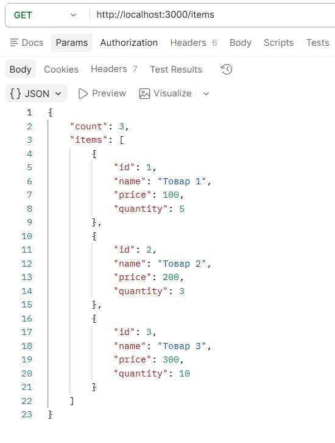

**GET Item by ID**  
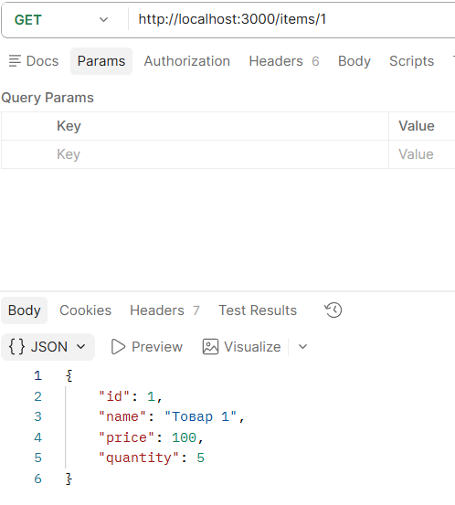

**POST Create Item**  
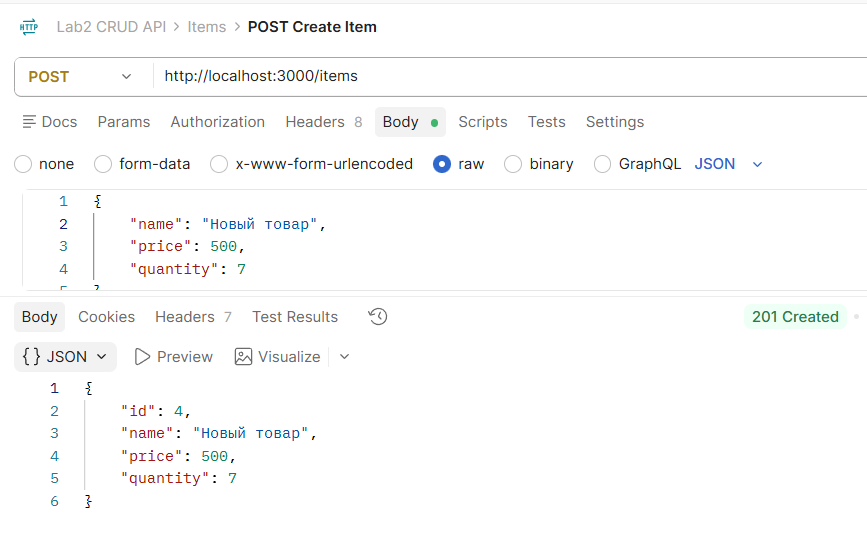

**PUT Update Item**  
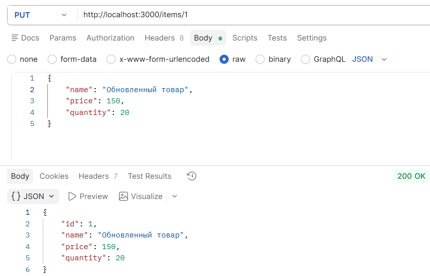

**DELETE Delete Item**  
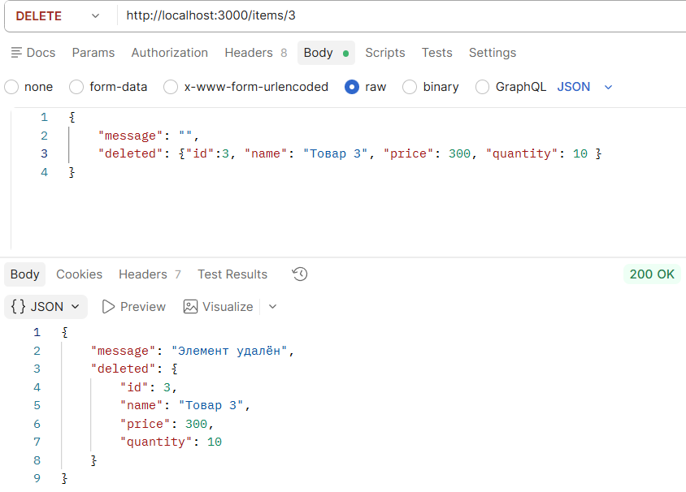

**GET Nonexistent Item (404)**  
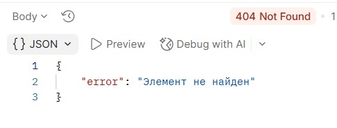

**POST Invalid Data (400)**  
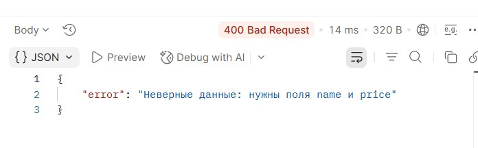

### 2. Testы Results (все тесты PASS)

#### GET All Items
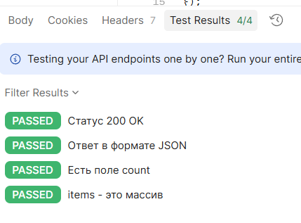

#### GET Item by ID
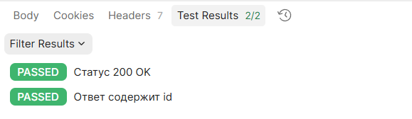

#### POST Create Item
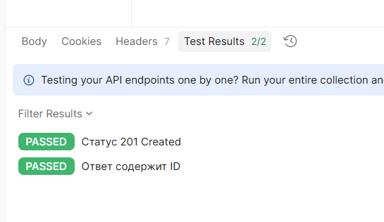

#### PUT Update Item
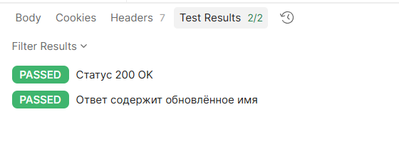

#### DELETE Delete Item
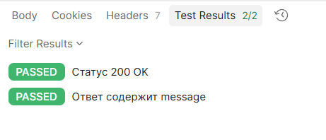

#### GET Nonexistent Item (404)
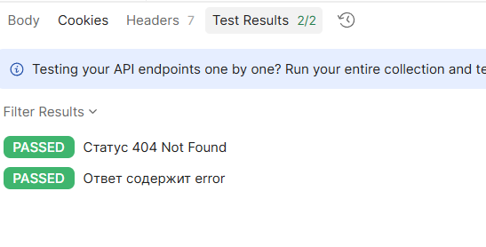

#### POST Invalid Data (400)
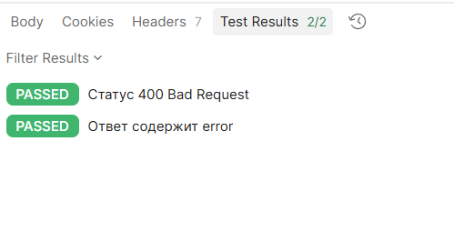

### 3. Collection Runner с результатами всех тестов

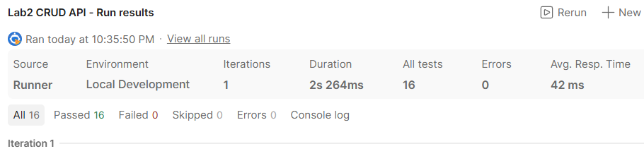

---

## Выполнение индивидуального задания

**Вариант 14** — Рестораны (restaurants).  
**Поля:** id, name, cuisine, address, rating  
**Дополнительные функции:** поиск по name, сортировка, пагинация, PATCH, массовые операции, статистика (средний рейтинг), связи по кухне, логирование в файл, глобальный обработчик ошибок.

### Код сервера (app.js)

**Поля сущности:** id, name, cuisine, address, rating  
**Дополнительные функции (средний уровень):**
- Валидация входных данных (обязательные поля, тип, диапазон) с возвратом 400 Bad Request
- Поиск по `name` (query-параметр `search`)
- Сортировка по любому полю (`sort`, `order`)
- Пагинация (`page`, `limit`)
- Корректные коды ответов: 200, 201, 204, 400, 404

---

### Код сервера (`app.js`)

```javascript

const express = require('express');
const app = express();
const port = 3001;

// Middleware для парсинга JSON из тела запроса
app.use(express.json());

// Middleware для логирования запросов
app.use((req, res, next) => {
  console.log(`[${new Date().toISOString()}] ${req.method} ${req.url}`);
  next();
});

// ХРАНИЛИЩЕ ДАННЫХ В ПАМЯТИ 
let restaurants = [
  { id: 1, name: 'Пушкин', cuisine: 'Русская', address: 'Москва, Тверской б-р, 26А', rating: 4.8 },
  { id: 2, name: 'Bologna', cuisine: 'Итальянская', address: 'Москва, ул. Арбат, 10', rating: 4.5 },
  { id: 3, name: 'Sushi Bar', cuisine: 'Японская', address: 'СПб, Невский пр., 50', rating: 4.2 },
  { id: 4, name: 'Provence', cuisine: 'Французская', address: 'Москва, Кутузовский пр., 12', rating: 4.9 }
];

let nextId = 5;

// GET /restaurants — список с поиском, сортировкой и пагинацией
app.get('/restaurants', (req, res) => {
  let result = [...restaurants];

  // 1. ПОИСК по name (query: ?search=...)
  if (req.query.search) {
    const search = req.query.search.toLowerCase();
    result = result.filter(r => r.name.toLowerCase().includes(search));
  }

  // 2. СОРТИРОВКА (query: ?sort=field&order=asc|desc)
  if (req.query.sort) {
    const field = req.query.sort;
    const order = req.query.order === 'desc' ? -1 : 1;
    result.sort((a, b) => {
      if (a[field] < b[field]) return -1 * order;
      if (a[field] > b[field]) return 1 * order;
      return 0;
    });
  }

  // 3. ПАГИНАЦИЯ (query: ?page=1&limit=2)
  if (req.query.page && req.query.limit) {
    const page = parseInt(req.query.page);
    const limit = parseInt(req.query.limit);
    const start = (page - 1) * limit;
    result = result.slice(start, start + limit);
  }

  res.json({ count: result.length, restaurants: result });
});

// GET /restaurants/:id — один ресторан
app.get('/restaurants/:id', (req, res) => {
  const id = parseInt(req.params.id);
  const restaurant = restaurants.find(r => r.id === id);
  if (!restaurant) {
    return res.status(404).json({ error: 'Ресторан не найден' });
  }
  res.json(restaurant);
});

// POST /restaurants — создание с валидацией
app.post('/restaurants', (req, res) => {
  const { name, cuisine, address, rating } = req.body;

  // Проверка обязательных полей
  if (!name || !cuisine) {
    return res.status(400).json({ error: 'Поля name и cuisine обязательны' });
  }

  // Проверка типа и допустимых значений для rating
  if (rating !== undefined) {
    if (typeof rating !== 'number') {
      return res.status(400).json({ error: 'Поле rating должно быть числом' });
    }
    if (rating < 0 || rating > 5) {
      return res.status(400).json({ error: 'Поле rating должно быть в диапазоне от 0 до 5' });
    }
  }

  const newRestaurant = {
    id: nextId++,
    name,
    cuisine,
    address: address || '',
    rating: rating !== undefined ? rating : 0
  };
  restaurants.push(newRestaurant);
  res.status(201).json(newRestaurant);
});

// PUT /restaurants/:id — полное обновление
app.put('/restaurants/:id', (req, res) => {
  const id = parseInt(req.params.id);
  const index = restaurants.findIndex(r => r.id === id);
  if (index === -1) {
    return res.status(404).json({ error: 'Ресторан не найден' });
  }

  const { name, cuisine, address, rating } = req.body;

  // Валидация
  if (!name || !cuisine) {
    return res.status(400).json({ error: 'Поля name и cuisine обязательны' });
  }
  if (rating !== undefined && (typeof rating !== 'number' || rating < 0 || rating > 5)) {
    return res.status(400).json({ error: 'Поле rating должно быть числом от 0 до 5' });
  }

  restaurants[index] = {
    id,
    name,
    cuisine,
    address: address || '',
    rating: rating !== undefined ? rating : 0
  };
  res.json(restaurants[index]);
});

// DELETE /restaurants/:id — удаление (204 No Content)
app.delete('/restaurants/:id', (req, res) => {
  const id = parseInt(req.params.id);
  const index = restaurants.findIndex(r => r.id === id);
  if (index === -1) {
    return res.status(404).json({ error: 'Ресторан не найден' });
  }
  restaurants.splice(index, 1);
  // 204 No Content — успешное удаление без тела ответа
  res.status(204).send();
});

// ОБРАБОТКА 404 (для всех остальных маршрутов)
app.use((req, res) => {
  res.status(404).json({ error: 'Маршрут не найден' });
});

// ЗАПУСК СЕРВЕРА
app.listen(port, () => {
  console.log(`Сервер запущен на http://localhost:${port}`);
});
```

---


### Команды для запуска

```bash
npm install express
npm install --save-dev nodemon
npm run dev
```

### Скриншоты всех запросов из Postman с ответами

#### 1.1. GET All Restaurants  
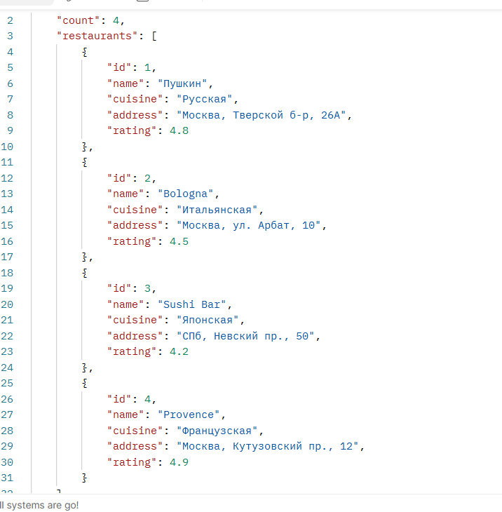

#### 1.2. GET Restaurant by ID
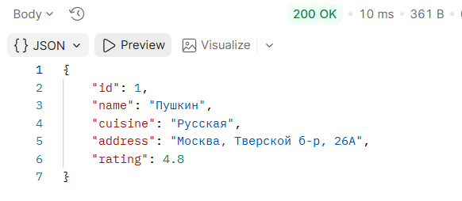

#### 1.3. GET Search
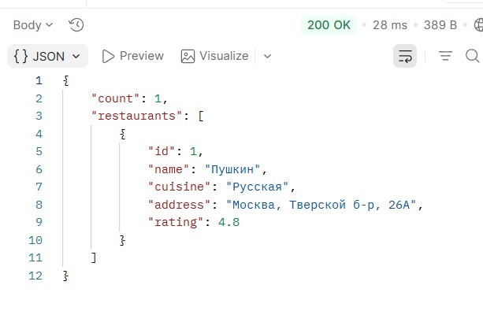

#### 1.4. GET Sort
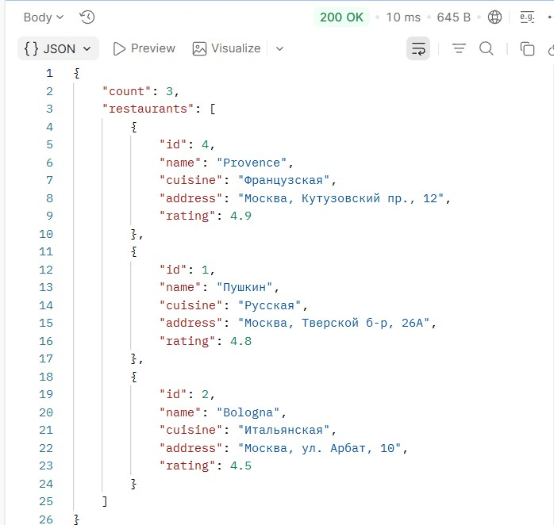

#### 1.5. GET Pagination
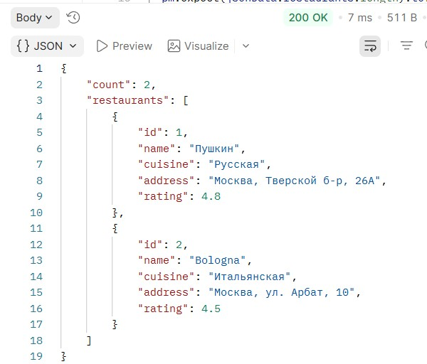

#### 1.6. POST Create Restaurant
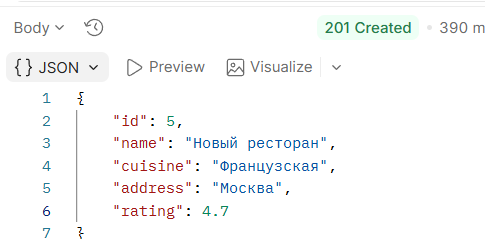

#### 1.7. PUT Update Restaurant  
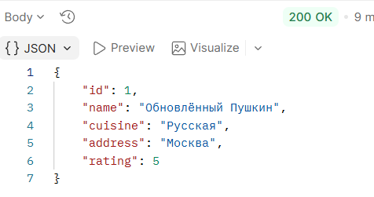

#### 1.8. DELETE Delete Restaurant 
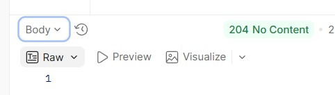

#### 1.9. GET Nonexistent Restaurant (404)
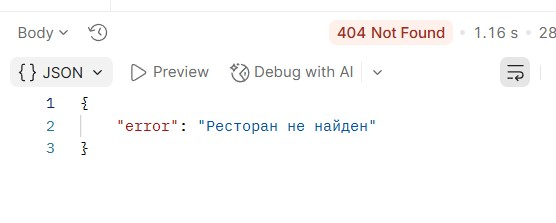

#### 1.10. POST Invalid Data (400)
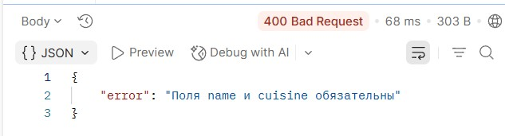

---

### 2. Test Results (все тесты PASS)

#### 2.1. Test Results — GET All Restaurants
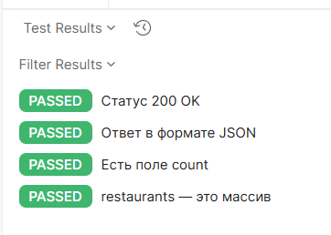

#### 2.2. Test Results — POST Create Restaurant
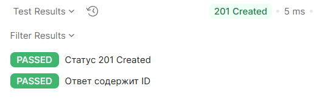

#### 2.3. Test Results — GET Nonexistent (404)
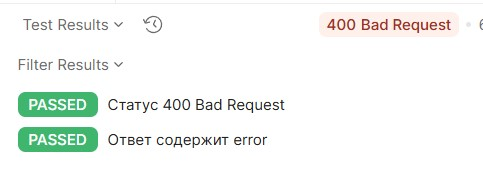

#### 2.4. Test Results — POST Invalid Data (400)
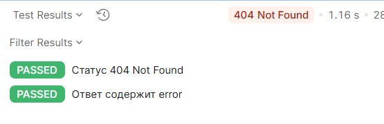


## Контрольные вопросы (продвинутый уровень)

**1. Как реализовать частичное обновление (PATCH)?**  
PATCH принимает только те поля, которые нужно обновить. Через `Object.keys(req.body)` перебираем поля и присваиваем их существующему объекту:
```javascript
app.patch('/restaurants/:id', (req, res) => {
  const r = restaurants.find(x => x.id === parseInt(req.params.id));
  if (!r) return res.status(404).json({ error: 'Не найдено' });
  Object.keys(req.body).forEach(key => r[key] = req.body[key]);
  res.json(r);
});
```

**2. Как реализовать массовое удаление элементов?**  
```javascript
app.delete('/restaurants', (req, res) => {
  const count = restaurants.length;
  restaurants = [];
  res.json({ message: 'Все удалены', count });
});
```

**3. Как реализовать массовое создание элементов?**  
Через `POST /restaurants/bulk` принимаем массив и в цикле создаём элементы:
```javascript
app.post('/restaurants/bulk', (req, res) => {
  const created = req.body.map(item => ({ id: nextId++, ...item }));
  restaurants.push(...created);
  res.status(201).json({ created: created.length, restaurants: created });
});
```

**4. Как реализовать глобальный обработчик ошибок?**  
Middleware с 4 аргументами в конце:
```javascript
app.use((err, req, res, next) => {
  console.error(err.stack);
  res.status(500).json({ error: 'Внутренняя ошибка сервера' });
});
```

**5. Как логировать запросы в файл?**  
Через `fs.appendFile`:
```javascript
const fs = require('fs');
app.use((req, res, next) => {
  fs.appendFile('access.log', `[${new Date().toISOString()}] ${req.method} ${req.url}\n`, () => {});
  next();
});
```

**6. Что такое REST API и какие принципы лежат в его основе?**  
REST (Representational State Transfer) — архитектурный стиль для API. Принципы: клиент-сервер, отсутствие состояния (stateless), кэширование, единый интерфейс, слоистая структура. Ресурсы идентифицируются URL, действия — HTTP-методами.

**7. Как организовать структуру проекта для масштабируемого CRUD API?**  
Разделять на слои: `routes/` (маршруты), `controllers/` (логика), `models/` (данные), `middleware/` (логирование, валидация), `config/`. Каждый ресурс — свой файл.

**8. Какие существуют стратегии генерации уникальных ID?**  
- Счётчик (`nextId++`) — простой, но сбрасывается при перезапуске.
- UUID (`crypto.randomUUID()`) — глобально уникальный.
- Timestamp + случайное число.
- База данных (AUTO_INCREMENT, ObjectId в MongoDB).

**9. Как защитить API от слишком больших запросов?**  
Установить лимит на размер тела:
```javascript
app.use(express.json({ limit: '10kb' }));
```
Плюс пагинация и лимиты на количество создаваемых элементов.

**10. Как реализовать связь между сущностями (например, задачи и пользователи)?**  
Хранить `userId` в объекте задачи, а для получения связанных — фильтровать:
```javascript
app.get('/restaurants/:id/related', (req, res) => {
  const r = restaurants.find(x => x.id === parseInt(req.params.id));
  const related = restaurants.filter(x => x.cuisine === r.cuisine && x.id !== r.id);
  res.json({ cuisine: r.cuisine, related });
});
```

---

## Вывод
В ходе работы освоила обработку различных HTTP-методов (GET, POST, PUT, DELETE) в Express/Flask. Научилась реализовывать CRUD-операции над коллекцией объектов, хранящейся в памяти сервера, а также возвращать корректные HTTP-коды ответов (200, 201, 404).Освоил работу с Postman: создание коллекций, тесты, Collection Runner, экспорт.
---

## Список использованных источников
1. [Express Routing](https://expressjs.com/en/guide/routing.html)
2. [Express Request и Response](https://expressjs.com/en/4x/api.html)
3. [HTTP-методы (MDN)](https://developer.mozilla.org/ru/docs/Web/HTTP/Methods)
4. [Коды состояния HTTP (MDN)](https://developer.mozilla.org/ru/docs/Web/HTTP/Status)
5. [REST API Tutorial](https://restfulapi.net/)
6. [Postman Learning Center](https://learning.postman.com/)