# Лабораторная работа №3: Маршрутизация, параметры пути и query-параметры

**Студент:** Калмазова Серафима Владимировна  
**Группа:** ПИЖ-б-о-25-1  
**Вариант:** 14 (Рестораны)  
**Технология:** Node.js + Express

---

## Содержание
1. [Цель работы](#цель-работы)
2. [Теоретическое обоснование](#теоретическое-обоснование)
3. [Выполнение практического примера](#выполнение-практического-примера)
4. [Выполнение индивидуального задания](#выполнение-индивидуального-задания)
5. [Контрольные вопросы](#контрольные-вопросы)
6. [Вывод](#вывод)
7. [Список использованных источников](#список-использованных-источников)

## Цель работы
Освоить различные способы передачи данных через URL. Научиться строить гибкие маршруты с параметрами пути и query-параметрами, комбинировать их, обрабатывать вложенные ресурсы и валидировать входные данные. Понять разницу между `req.params`, `req.query` и `req.body`.

## Теоретическое обоснование

**Маршрутизация (routing)** — механизм сопоставления HTTP-запроса (метод + URL) с кодом-обработчиком на сервере. В Express маршрут описывается как `app.METHOD(PATH, HANDLER)`, где `METHOD` — HTTP-метод, `PATH` — путь URL, `HANDLER` — функция-обработчик, принимающая `req` и `res`.

**Три источника данных в запросе:**
| Источник | Где находится | Express |
|----------|---------------|---------|
| Параметры пути | Часть URL: `/users/42` | `req.params.id` |
| Query-параметры | После `?`: `/users?age=20` | `req.query.age` |
| Тело запроса | Тело POST/PUT/PATCH | `req.body` |

**Параметры пути** — именованная часть URL, извлекается сервером и передаётся в обработчик. В Express параметр всегда строка (нужен `parseInt`).

**Query-параметры** — пары «ключ=значение» после `?`. Используются для фильтрации, сортировки, пагинации, поиска. Всегда строки.

**Вложенные маршруты** отражают иерархию ресурсов: `/restaurants/1/dishes` — блюда ресторана 1.

**Wildcard-маршрут** (`app.use` без пути) — соответствует любому пути, используется для 404. Должен идти **последним**.

**Валидация параметров** — обязательна, так как параметры приходят строками. Проверяем `isNaN(id)` → 400; не найден → 404.

---

## Выполнение практического примера

### Код сервера (app_example.js)

```javascript
const express = require('express');
const app = express();
const port = 3000;
app.use(express.json());
app.use((req, res, next) => {
    console.log(`[${new Date().toISOString()
        }
    ] ${req.method
    } ${req.url
    }`);
    next();
});

// ============ ДАННЫЕ ============
let cities = [
    { id: 1, name: 'Москва', population: 13000000, country: 'Россия', area:
2561
    },
    { id: 2, name: 'Санкт-Петербург', population: 5600000, country: 'Россия',
area: 1439
    },
{ id: 3, name: 'Новосибирск', population: 1600000, country: 'Россия',
area: 505
    },
    { id: 4, name: 'Екатеринбург', population: 1500000, country: 'Россия',
area: 1112
    },
    { id: 5, name: 'Казань', population: 1250000, country: 'Россия', area: 425
    }
];

// ============ БАЗОВЫЙ УРОВЕНЬ ============
// GET /cities - все города


// GET /cities/:id - один город
app.get('/cities/:id', (req, res) => {
const id = parseInt(req.params.id);

if (isNaN(id)) {
    return res.status(400).json({ error: 'ID должен быть числом'
    });
}

const city = cities.find(c => c.id === id);
if (!city) {
    return res.status(404).json({ error: 'Город не найден'
    });
}

res.json(city);
});

// GET /cities/:id/area - площадь города
app.get('/cities/:id/area', (req, res) => {
    const id = parseInt(req.params.id);
    const city = cities.find(c => c.id === id);
    if (!city) {
        return res.status(404).json({ error: 'Город не найден'
        });
    }

    res.json({
        city: city.name,
        area: city.area,
        unit: 'км²'
    });
});

// GET /countries/:country/cities - города страны
app.get('/countries/:country/cities', (req, res) => {
    const country = req.params.country;
    const filtered = cities.filter(c =>
        c.country.toLowerCase() === country.toLowerCase()
    );
    res.json({
        country,
        count: filtered.length,
        cities: filtered
    });
});

// ============ СРЕДНИЙ УРОВЕНЬ ============
// GET /cities?search=&sort=&order=&page=&limit=
app.get('/cities', (req, res) => {
  let result = [...cities];

  const search = req.query.search;
  if (search) {
    result = result.filter(c => c.name.toLowerCase().includes(search.toLowerCase()));
  }

  const country = req.query.country;
  if (country) {
    result = result.filter(c => c.country.toLowerCase() === country.toLowerCase());
  }

  const sort = req.query.sort;
  const order = req.query.order || 'asc';
  const allowedSortFields = ['id', 'name', 'population', 'area'];

  if (sort) {
    if (!allowedSortFields.includes(sort)) {
      return res.status(400).json({
        error: `Поле сортировки должно быть одним из: ${allowedSortFields.join(', ')}`
      });
    }
    if (!['asc', 'desc'].includes(order)) {
      return res.status(400).json({ error: 'Параметр order должен быть asc или desc' });
    }
    result.sort((a, b) =>
      order === 'desc'
        ? (a[sort] < b[sort] ? 1 : -1)
        : (a[sort] > b[sort] ? 1 : -1)
    );
  }

  const page = parseInt(req.query.page) || 1;
  const limit = parseInt(req.query.limit) || 10;

  if (page < 1) return res.status(400).json({ error: 'page должен быть >= 1' });
  if (limit < 1 || limit > 100) {
    return res.status(400).json({ error: 'limit должен быть от 1 до 100' });
  }

  const start = (page - 1) * limit;
  const paginated = result.slice(start, start + limit);

  res.json({
    count: result.length,
    page,
    limit,
    totalPages: Math.ceil(result.length / limit),
    cities: paginated
  });
});

// ============ ПРОДВИНУТЫЙ УРОВЕНЬ ============
// GET /cities/:id/details - детальная информация с вложенными данными
app.get('/cities/:id/details', (req, res) => {
    const id = parseInt(req.params.id);
    const city = cities.find(c => c.id === id);

    if (!city) {
        return res.status(404).json({ error: 'Город не найден'
    });
}
// Имитация вложенных данных
const districts = [
    { id: 1, name: 'Центральный', cityId: id
    },
    { id: 2, name: 'Северный', cityId: id
    }
];

res.json({
    city,
    districts,
    attractions: ['Кремль', 'Парк', 'Музей'
    ]
});
});
// GET /countries/:country/cities/:cityId - город в стране
app.get('/countries/:country/cities/:cityId', (req, res) => {
    const { country, cityId
    } = req.params;
    const id = parseInt(cityId);
    const city = cities.find(c =>
        c.id === id &&
        c.country.toLowerCase() === country.toLowerCase()
    );

    if (!city) {
        return res.status(404).json({
            error: `Город с ID=${cityId
            } не найден в стране ${country
            }`
        });
    }
    res.json({
        country,
        city
    });
});

// ============ ОБРАБОТКА 404 ============
app.use((req, res) => {
    res.status(404).json({ error: 'Маршрут не найден'
    });
});
app.listen(port, () => {
    console.log(`Сервер запущен на http: //localhost:${port}`);
});
```

### Команды для запуска

```bash
npm install express
npm install --save-dev nodemon
npm run dev-example
```

### Скриншоты практического примера

Скриншоты всех запросов из Postman с ответами

**GET /cities — все города**  
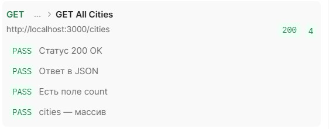

**GET /cities/1**  
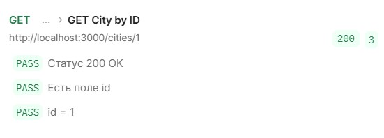

**GET /cities/999 (404)**  
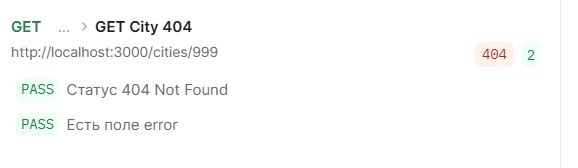

**GET /cities/abc (400)**  
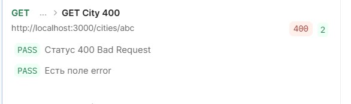

**GET /cities/1/area**  
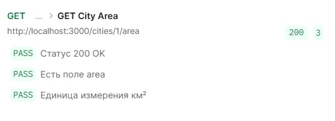

**GET /countries/Россия/cities**  
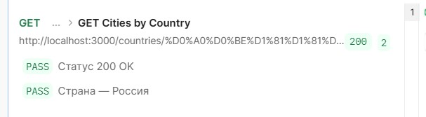

**GET /cities?search=Москва**  
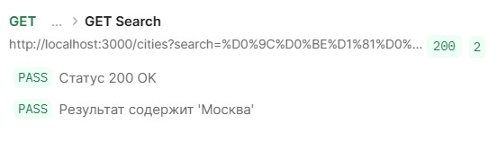

**GET /cities?sort=population&order=desc**  
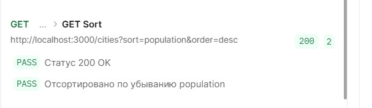

**GET /cities?page=1&limit=2**  
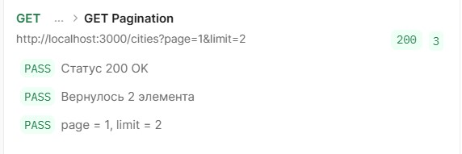

---

## Выполнение индивидуального задания

**Вариант 14** — Рестораны (restaurants).  
**Поля:** id, name, cuisine, address, rating  
**Вложенный ресурс:** `/restaurants/:id/dishes`  
**Категория:** `/cuisines/:cuisine/restaurants`

### Код сервера (app.js)

```javascript
const express = require('express');
const app = express();
const port = 3008;

app.use(express.json());

// Логирование
app.use((req, res, next) => {
  console.log(`[${new Date().toISOString()}] ${req.method} ${req.url}`);
  next();
});

// ========== ХРАНИЛИЩЕ ==========
let restaurants = [
  { id: 1, name: 'Пушкин', cuisine: 'Русская', rating: 4.8, address: 'Москва' },
  { id: 2, name: 'Bologna', cuisine: 'Итальянская', rating: 4.5, address: 'Москва' },
  { id: 3, name: 'Sushi Bar', cuisine: 'Японская', rating: 4.2, address: 'СПб' },
  { id: 4, name: 'Provence', cuisine: 'Французская', rating: 4.9, address: 'Москва' },
  { id: 5, name: 'Tiflis', cuisine: 'Грузинская', rating: 4.6, address: 'Москва' },
  { id: 6, name: 'Trattoria', cuisine: 'Итальянская', rating: 4.3, address: 'СПб' }
];

const dishes = {
  1: [{ id: 101, name: 'Борщ', price: 350 }],
  2: [{ id: 201, name: 'Паста', price: 550 }],
  3: [{ id: 301, name: 'Суши', price: 900 }]
};

// ====================================================
// GET /restaurants — все + search + filter + sort + pagination
// ====================================================
app.get('/restaurants', (req, res) => {
  let result = [...restaurants];

  // 1. ПОИСК (search)
  const search = req.query.search;
  if (search) {
    result = result.filter(r =>
      r.name.toLowerCase().includes(search.toLowerCase())
    );
  }

  // 2. ФИЛЬТРАЦИЯ (filter=field:value)
  const filter = req.query.filter;
  if (filter) {
    const [field, value] = filter.split(':');
    const allowedFilterFields = ['cuisine', 'rating'];

    if (!allowedFilterFields.includes(field)) {
      return res.status(400).json({
        error: `Фильтрация возможна только по полям: ${allowedFilterFields.join(', ')}`
      });
    }

    result = result.filter(r => {
      if (field === 'rating') {
        return parseFloat(r[field]) === parseFloat(value);
      }
      return String(r[field]).toLowerCase() === value.toLowerCase();
    });
  }

  // 3. СОРТИРОВКА (sort=field&order=asc|desc)
  const sort = req.query.sort;
  const order = req.query.order || 'asc';
  const allowedSortFields = ['id', 'name', 'rating'];

  if (sort) {
    if (!allowedSortFields.includes(sort)) {
      return res.status(400).json({
        error: `Поле сортировки должно быть одним из: ${allowedSortFields.join(', ')}`
      });
    }
    if (!['asc', 'desc'].includes(order)) {
      return res.status(400).json({ error: 'Параметр order должен быть asc или desc' });
    }
    result.sort((a, b) => {
      if (order === 'desc') return a[sort] < b[sort] ? 1 : -1;
      return a[sort] > b[sort] ? 1 : -1;
    });
  }

  // 4. ПАГИНАЦИЯ (page=1&limit=10) — ИСПРАВЛЕНО
  let page = 1;
  let limit = 10;

  if (req.query.page !== undefined) {
    page = parseInt(req.query.page);
    if (isNaN(page) || page < 1) {
      return res.status(400).json({ error: 'page должен быть >= 1' });
    }
  }

  if (req.query.limit !== undefined) {
    limit = parseInt(req.query.limit);
    if (isNaN(limit) || limit < 1 || limit > 100) {
      return res.status(400).json({ error: 'limit должен быть от 1 до 100' });
    }
  }

  const totalCount = result.length;
  const totalPages = Math.ceil(totalCount / limit);
  const start = (page - 1) * limit;
  const paginated = result.slice(start, start + limit);

  // Ответ пагинации: count, page, limit, totalPages, items
  res.json({
    count: totalCount,
    page: page,
    limit: limit,
    totalPages: totalPages,
    items: paginated
  });
});

// GET /restaurants/:id — один ресторан
app.get('/restaurants/:id', (req, res) => {
  const id = parseInt(req.params.id);
  if (isNaN(id) || id < 1) {
    return res.status(400).json({ error: 'ID должен быть положительным числом' });
  }
  const restaurant = restaurants.find(r => r.id === id);
  if (!restaurant) {
    return res.status(404).json({ error: 'Ресторан не найден' });
  }
  res.json(restaurant);
});

// GET /restaurants/:id/dishes — вложенный ресурс
app.get('/restaurants/:id/dishes', (req, res) => {
  const id = parseInt(req.params.id);
  if (isNaN(id) || id < 1) {
    return res.status(400).json({ error: 'ID должен быть положительным числом' });
  }
  const restaurant = restaurants.find(r => r.id === id);
  if (!restaurant) {
    return res.status(404).json({ error: 'Ресторан не найден' });
  }
  const list = dishes[id] || [];
  res.json({
    restaurantId: id,
    restaurant: restaurant.name,
    count: list.length,
    dishes: list
  });
});

// GET /cuisines/:cuisine/restaurants — элементы категории
app.get('/cuisines/:cuisine/restaurants', (req, res) => {
  const cuisine = req.params.cuisine;
  const filtered = restaurants.filter(r =>
    r.cuisine.toLowerCase() === cuisine.toLowerCase()
  );
  if (filtered.length === 0) {
    return res.status(404).json({ error: `Кухня "${cuisine}" не найдена` });
  }
  res.json({ cuisine, count: filtered.length, restaurants: filtered });
});

// ========== ОБРАБОТКА 404 ==========
app.use((req, res) => {
  res.status(404).json({ error: 'Маршрут не найден' });
});

app.listen(port, () => {
  console.log(`Сервер запущен на http://localhost:${port}`);
});
```

### Команды для запуска

```bash
npm install express
npm install --save-dev nodemon
npm run dev
```

### Скриншоты индивидуального задания

#### 1. GET /restaurants — все рестораны
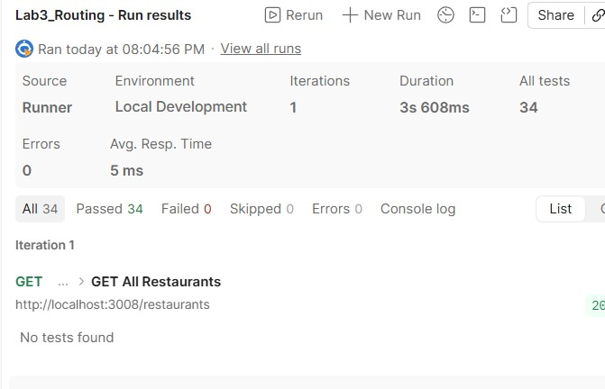

#### 2. GET /restaurants/1 — один ресторан
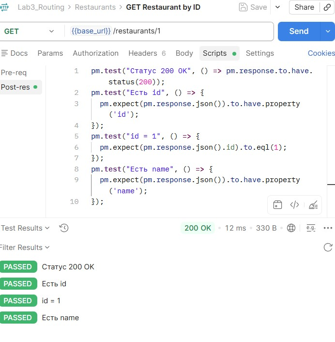

#### 3. GET /restaurants/999 — 404
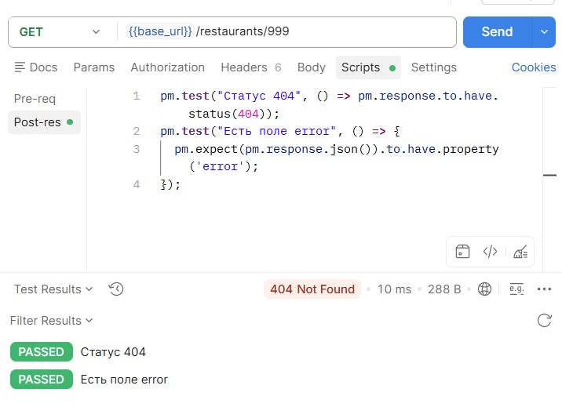

#### 4. GET /restaurants/abc — 400
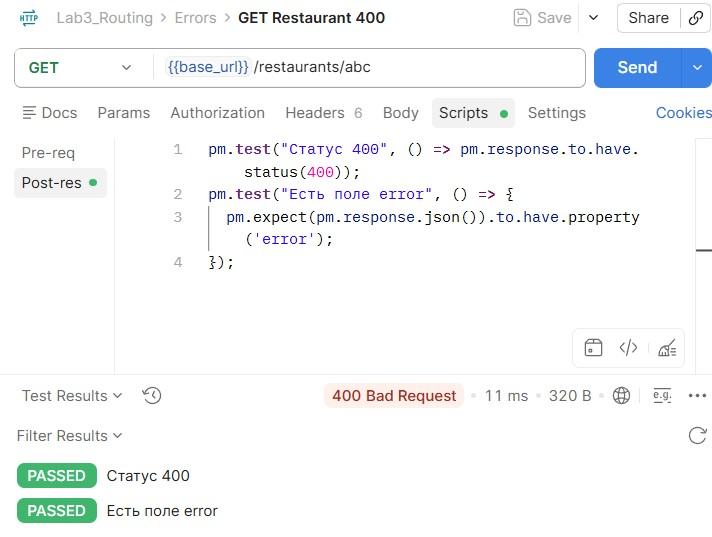

#### 5. GET /restaurants/1/dishes — вложенный ресурс
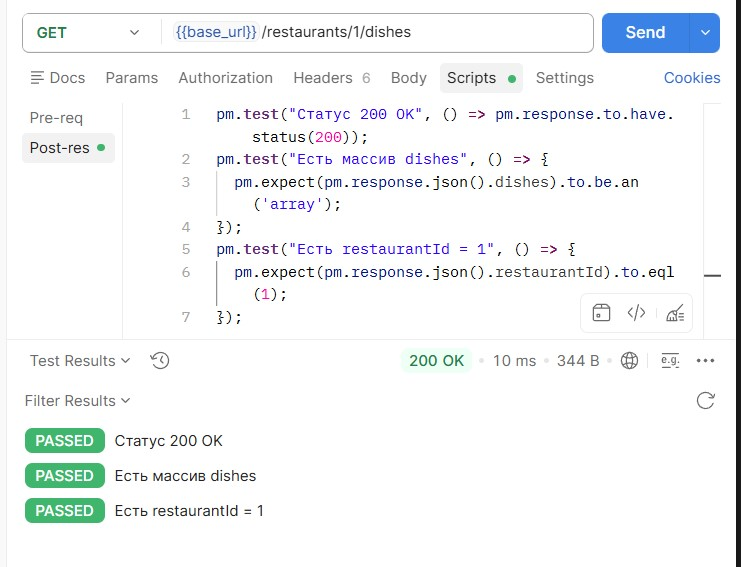

#### 6. GET /cuisines/Итальянская/restaurants — рестораны по кухне
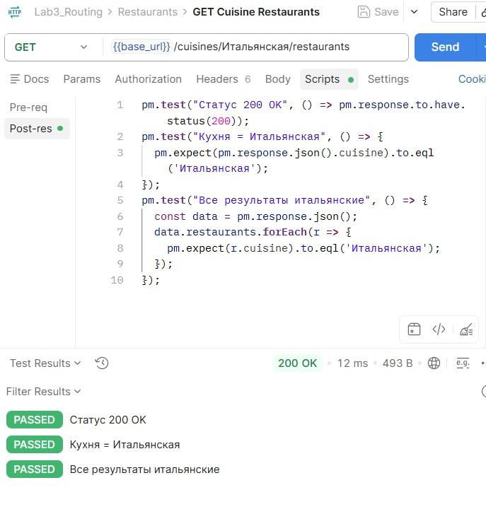

#### 7. GET /restaurants?search=пуш — поиск
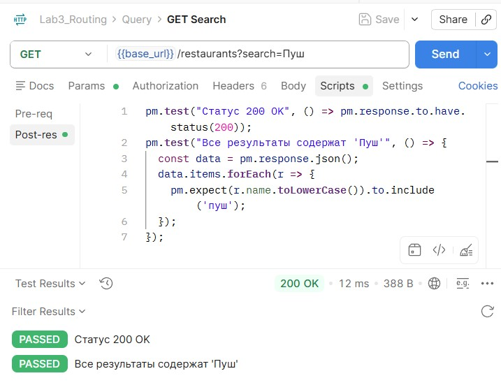

#### 8. GET /restaurants?sort=rating&order=desc — сортировка
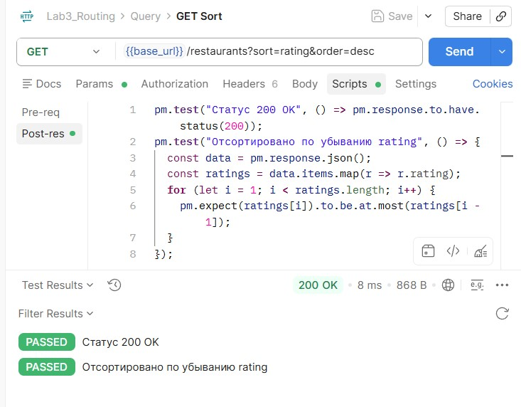

#### 9. GET /restaurants?page=1&limit=2 — пагинация
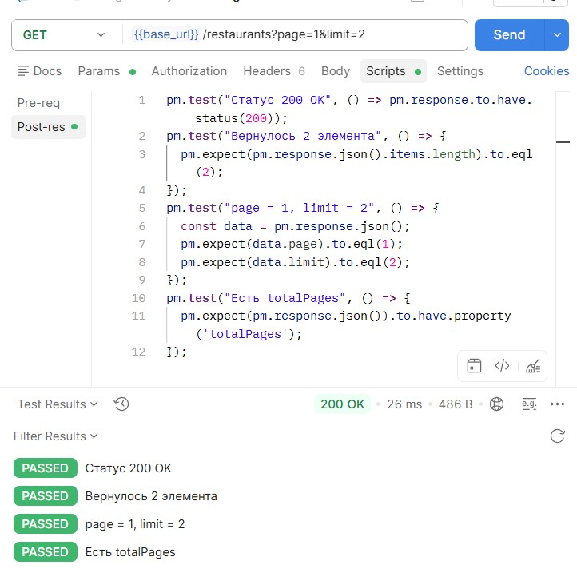

#### 10. GET /restaurants?filter=cuisine:Итальянская — фильтрация по кухне
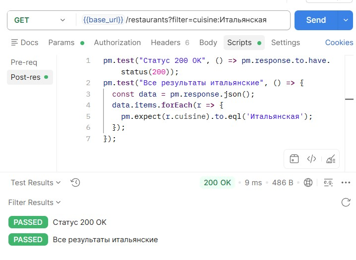

#### 11. GET /restaurants?filter=rating:4.5 — фильтрация по рейтингу
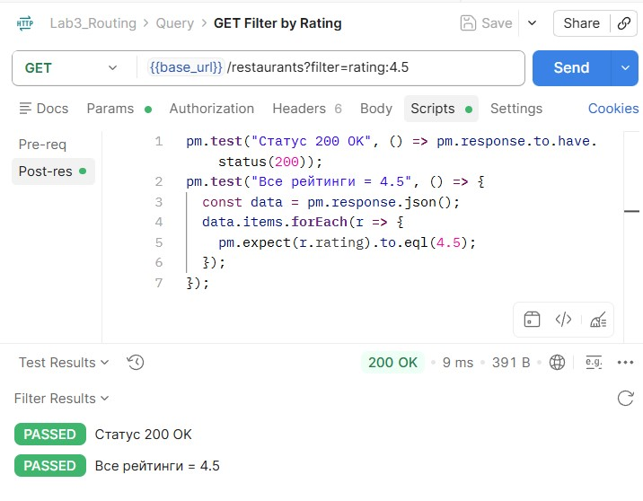

#### 12. GET /restaurants?sort=address&order=asc — 400 (sort не из белого списка)
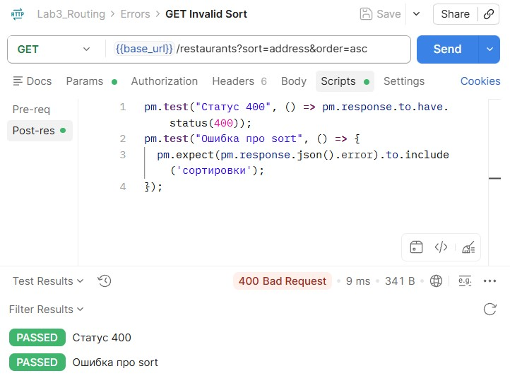

#### 13. GET /restaurants?sort=rating&order=up — 400 (order не asc/desc)
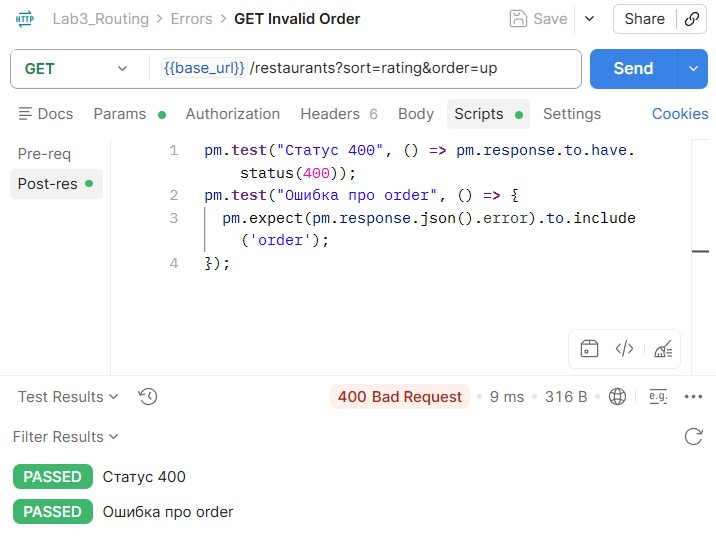

#### 14. GET /restaurants?page=0 — 400 (page < 1)
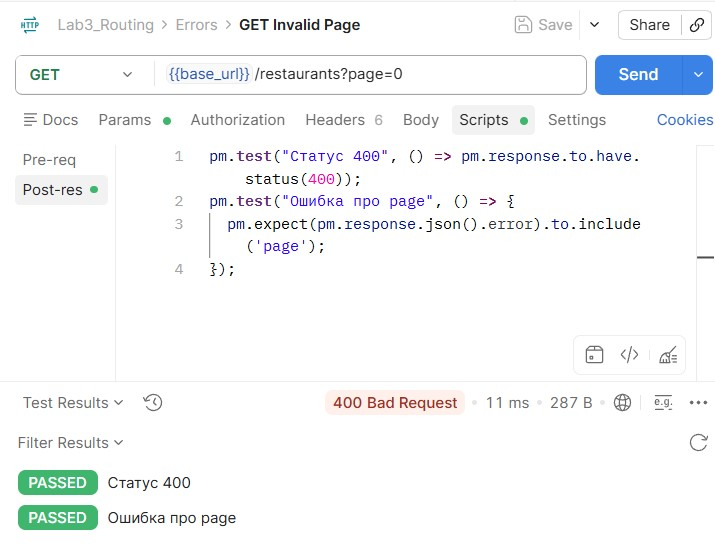

#### 15. GET /restaurants?limit=200 — 400 (limit > 100)
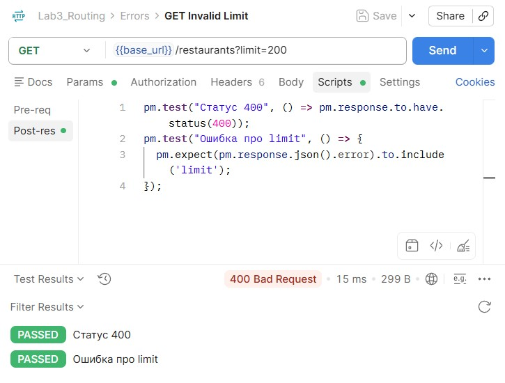

---

## Контрольные вопросы (продвинутый уровень)

### 20. Как комбинировать параметры пути и query-параметры в одном запросе?

Параметры пути (`req.params`) и query-параметры (`req.query`) **можно использовать одновременно**. Параметры пути — часть URL до `?`, query — после `?`.

**Пример:**
```javascript
app.get('/restaurants/:id/dishes', (req, res) => {
  const id = parseInt(req.params.id);           // путь
  const sort = req.query.sort;                  // query
  const order = req.query.order || 'asc';
  // ...
});
```

Запрос: `GET /restaurants/1/dishes?sort=price&order=desc`

### 21. Как реализовать вложенные маршруты с несколькими уровнями?

Указываем несколько `:параметров` в одном пути. Express передаёт их все в `req.params`.

```javascript
app.get('/cuisines/:cuisine/restaurants/:restaurantId/dishes/:dishId', (req, res) => {
  const { cuisine, restaurantId, dishId } = req.params;
  // ...
});
```

### 22. Как обработать wildcard-маршрут и почему он должен быть последним?

Wildcard — это `app.use((req, res) => {...})` **без указания пути**. Он срабатывает для всех запросов, которые не подошли ни под один маршрут.

**Почему последний:** Express проверяет маршруты **в порядке объявления**. Если поставить wildcard первым — он перехватит все запросы, и остальные маршруты не сработают.

```javascript
// Все маршруты выше
app.get('/restaurants', ...);
app.get('/restaurants/:id', ...);

// Wildcard — последний!
app.use((req, res) => {
  res.status(404).json({ error: 'Маршрут не найден' });
});
```

### 23. Как реализовать глобальный обработчик ошибок?

Middleware с **4 аргументами** (`err, req, res, next`) в самом конце файла:

```javascript
app.use((err, req, res, next) => {
  console.error(err.stack);
  res.status(500).json({ error: 'Внутренняя ошибка сервера' });
});
```

### 24. Как логировать все запросы с IP-адресом клиента?

Через middleware:

```javascript
app.use((req, res, next) => {
  const ip = req.ip || req.socket.remoteAddress;
  console.log(`[${new Date().toISOString()}] ${req.method} ${req.url} — IP: ${ip}`);
  next();
});
```

`req.ip` содержит IP клиента (если включён `trust proxy` — с учётом прокси).

### 25. Как защитить API от слишком больших значений limit?

Ограничить `limit` через валидацию:

```javascript
const limit = parseInt(req.query.limit) || 10;
if (limit < 1 || limit > 100) {
  return res.status(400).json({ error: 'limit должен быть от 1 до 100' });
}
```

Это защищает от запросов с `limit=999999` — иначе сервер вернёт огромный массив.

### 26. Как реализовать статистику по коллекции?

```javascript
app.get('/restaurants/stats', (req, res) => {
  const total = restaurants.length;
  const avgRating = restaurants.reduce((sum, r) => sum + r.rating, 0) / total;
  const maxRating = Math.max(...restaurants.map(r => r.rating));
  const minRating = Math.min(...restaurants.map(r => r.rating));

  const byCuisine = {};
  restaurants.forEach(r => {
    byCuisine[r.cuisine] = (byCuisine[r.cuisine] || 0) + 1;
  });

  res.json({ total, averageRating: avgRating.toFixed(2), maxRating, minRating, byCuisine });
});
```

### 27. Как организовать структуру проекта при росте числа маршрутов?

Разделять на слои:
```
project/
├── app.js              # основной файл
├── routes/             # маршруты по ресурсам
│   ├── restaurants.js
│   ├── cuisines.js
│   └── index.js
├── controllers/        # логика
├── models/             # данные
└── middleware/         # логирование, валидация
```

В `app.js` подключать: `app.use('/restaurants', require('./routes/restaurants'))`.

### 28. Как документировать параметры маршрутов (OpenAPI/Swagger)?

Установить `swagger-jsdoc` и `swagger-ui-express`, писать JSDoc-комментарии к маршрутам:

```javascript
/**
 * @swagger
 * /restaurants/{id}:
 *   get:
 *     summary: Получить ресторан по ID
 *     parameters:
 *       - in: path
 *         name: id
 *         required: true
 *         schema:
 *           type: integer
 *     responses:
 *       200: { description: OK }
 *       404: { description: Не найден }
 */
app.get('/restaurants/:id', ...);
```

### 29. Как тестировать маршруты с параметрами в Postman?

1. Создать запрос с URL вида `{{base_url}}/restaurants/1`.
2. Сохранить в коллекцию.
3. Написать тесты на вкладке **Tests → Post-response**:
```javascript
pm.test("Статус 200 OK", function () {
  pm.response.to.have.status(200);
});
pm.test("Ответ содержит id", function () {
  const jsonData = pm.response.json();
  pm.expect(jsonData).to.have.property('id');
});
```
4. Использовать **Collection Runner** для запуска всех запросов.
5. Экспортировать коллекцию в `.json`.

## Вывод
В ходе работы я освоил маршрутизацию в Express: параметры пути (`req.params`), query-параметры (`req.query`), вложенные маршруты, wildcard-маршрут и валидацию. Реализовал API для ресторанов: список с поиском/сортировкой/пагинацией, получение по ID, вложенный ресурс (блюда), фильтрацию по кухне, статистику, глобальный обработчик ошибок 500 и логирование с IP-адресом. Научился различать `req.params`, `req.query` и `req.body`. Трудности возникли с порядком маршрутов — маршрут `/restaurants/stats` пришлось поставить **до** `/restaurants/:id`, иначе Express принимал `stats` за ID. Полученные навыки — база для проектирования REST API.

## Список использованных источников
1. [Express — Routing](https://expressjs.com/en/guide/routing.html)
2. [Express — Request](https://expressjs.com/en/4x/api.html#req)
3. [Flask — Routing](https://flask.palletsprojects.com/en/latest/quickstart/#routing)
4. [HTTP-методы (MDN)](https://developer.mozilla.org/ru/docs/Web/HTTP/Methods)
5. [URL-параметры (MDN)](https://developer.mozilla.org/ru/docs/Learn/Common_questions/What_is_a_URL)
6. [REST API Tutorial](https://restfulapi.net/)
7. [Postman Learning Center](https://learning.postman.com/)